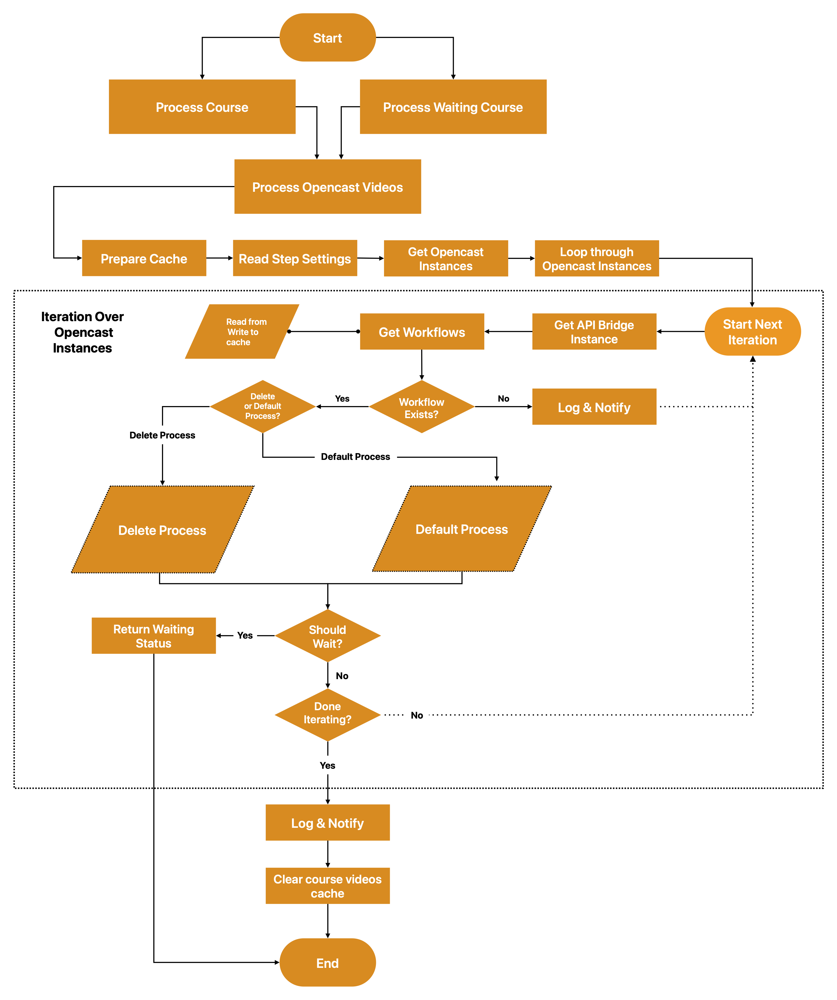
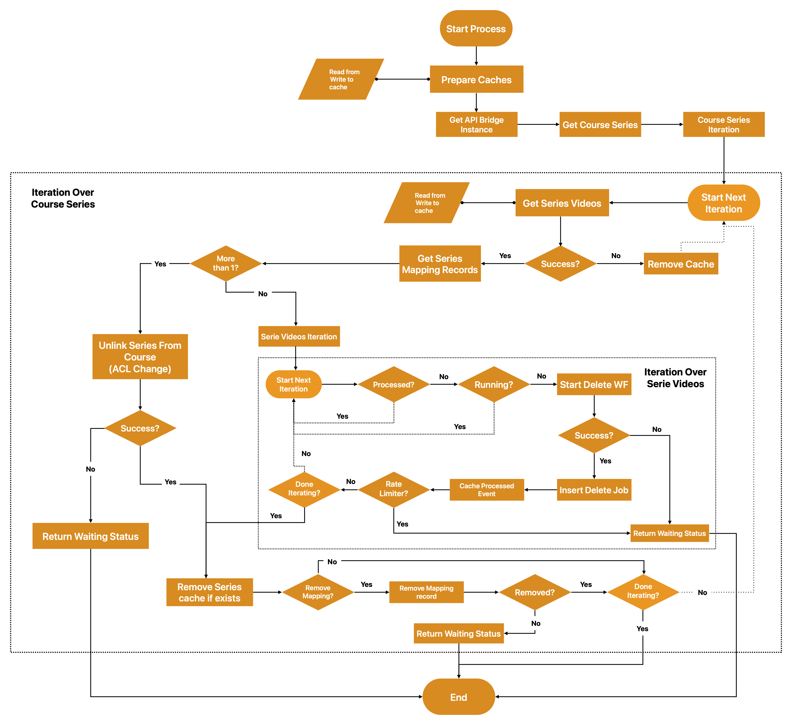
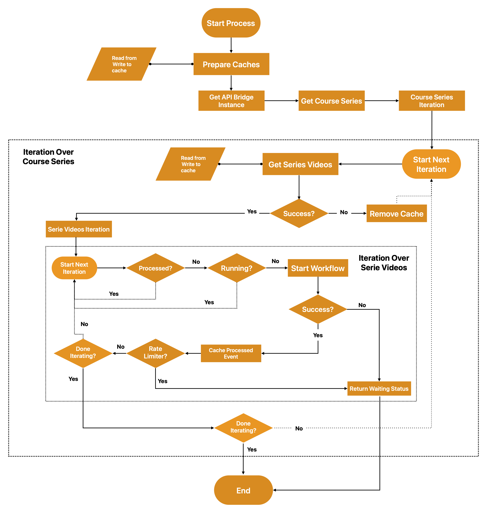
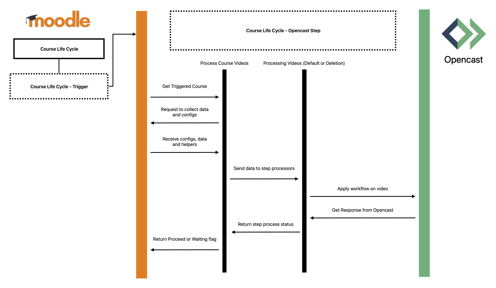

# Course Life Cycle Opencast Step (moodle-lifecyclestep_opencast)

## History

This plugin was originally developed in 2022 by Alexander Bias from [lern.link](https://lern.link/) on behalf of the [University of Ulm](https://www.uni-ulm.de/). It is currently maintained by [Farbod Zamani](https://github.com/ferishili) from [elan e.V.](https://elan-ev.de/).

## Requirements

* Moodle 4.5+
* Opencast 15+
* Moodle Opencast API plugin (`tool_opencast`) 4.5-rx
* Moodle Opencast Videos plugin (`block_opencast`) 4.5-rx
* Moodle Course Life Cycle (`tool_lifecycle`) 5.x

## Installation

This plugin is a subplugin of the Course Life Cycle admin tool and must be placed under `admin/tool/lifecycle/step`, however, using Moodle Plugin installation wizard is strongly recommended.

You can obtain the main Course Life Cycle plugin from:
[https://moodle.org/plugins/view/tool_lifecycle](https://moodle.org/plugins/view/tool_lifecycle)

Make sure the main plugin is installed before installing this subplugin.

## More Information

For detailed information about step plugins, please refer to the [Wiki](https://github.com/learnweb/moodle-tool_lifecycle/wiki) of the `moodle-tool_lifecycle` admin tool.

## Description

This plugin provides a step for the [Course Life Cycle](https://github.com/learnweb/moodle-tool_lifecycle) tool.

It allows administrators to define, for each course, what should happen to the associated Opencast videos after a configurable period of time. The step can either:

* Delete the Opencast events belonging to the Moodle course, or
* Run a specific Opencast workflow on each eligible event.

The step supports both duplication modes used by the Opencast integration:

* **ACL Change** (shared course series across multiple courses)
* **Event Duplication** (standard duplication mode)

In the case of shared series using the *ACL Change* mode, the step correctly handles ACL updates as required.

## Settings

The step automatically detects multi-tenancy configurations provided by the Opencast API plugin and applies the settings per Opencast instance accordingly.

### Opencast Instance–Specific Settings

For each configured Opencast instance, the following settings are available:

* **Opencast workflow**
  Defines the Opencast workflow that will be executed for each eligible event.

* **Enable deletion process**
  If enabled, events will be deleted when a course is processed by this step. If disabled, the configured workflow will be executed instead.

* **Remove series mapping when deleting**
  If the deletion process is enabled, this option ensures that the series-to-course mapping in Moodle is also removed.

### General Settings

In addition to the instance-specific settings, the following general options are available:

* **Enable trace**
  Logs and traces the entire process step by step.

* **Enable admin notification**
  Notifies administrators if an error occurs during processing.

## Concept

The following diagrams illustrate the overall processing logic.

### Top-Level Process

### Deletion Process

If the deletion process is enabled for an Opencast instance, processing follows this flow:

### Default Process

If the deletion process is disabled, the step executes the configured workflow for each eligible event:

### Sequence Diagram

